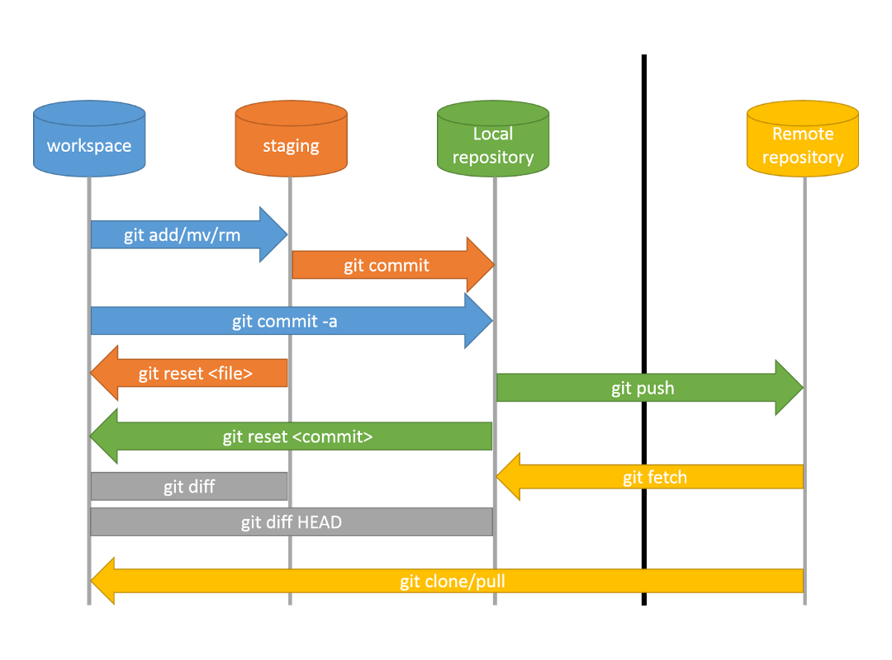

# Общие понятия в GIT:

| Git (Гит) | Это распределенная система управления версиями, которая используется для отслеживания изменений в файловой системе проекта. Она позволяет разработчикам эффективно сотрудничать, отслеживать изменения, вносить исправления и управлять версиями своего кода. |
| :---: | :---: |
| **Repository (Репозиторий)** | Представляет собой хранилище для всех файлов, истории изменений и метаданных проекта. Он содержит все версии файлов и информацию о коммитах. |
| **Commit (Коммит)** | Представляет собой фиксацию изменений в репозитории. Каждый коммит содержит информацию о внесенных изменениях, авторе коммита, времени и других метаданных. Коммиты образуют историю изменений проекта. |
| **Branch (Ветка)** | Представляет собой отдельную линию разработки в репозитории. Она позволяет разработчикам работать над разными функциональностями или исправлениями параллельно, не затрагивая основную ветку разработки. Ветки могут быть созданы, переключены, объединены и удалены. |
| **Tag (Тег)** | Представляет собой именованную точку в истории коммитов. Он используется для пометки определенных версий проекта или важных моментов в истории разработки. Теги обычно используются для обозначения релизов или стабильных версий проекта. |
| **Remote Repository (Удаленный репозиторий)** | Представляет собой копию репозитория, которая находится на удаленном сервере. Он позволяет разработчикам совместно работать над проектом, обмениваться изменениями и синхронизировать свои локальные репозитории с общим источником. |
| **Index (Индекс)** | Также известный как "промежуточная зона" или "область подготовки", представляет собой промежуточный шаг между рабочим каталогом и коммитом. Он содержит список изменений, которые будут включены в следующий коммит. |
| **Pull Request (Пулл реквест)** | Это механизм совместной работы в системах контроля версий, таких как Git. Он используется для предложения изменений в коде проекта и их последующего рассмотрения и включения в основную ветку проекта. |
| **Merge (Мерж)** | Означает объединение изменений из одной ветки с другой веткой. Это процесс, при котором изменения, внесенные в одну ветку, включаются в другую ветку, чтобы объединить различные линии разработки. |
| **Merge Conflict (Конфликт слияния)** | Конфликт слияния возникает, когда Git не может автоматически объединить две ветки из-за конфликта в изменениях. Разработчику требуется вручную разрешить конфликт, выбрав правильные изменения из обоих веток. |



# Инструкция по GIT:


### Ссылки на скачивание самого ПО:

https://git-scm.com/download/win - Windows

https://git-scm.com/download/linux - Linux

https://git-scm.com/download/mac - Mac
_______________________________________________________________________________________________________________________________________________________________________

> Если с нуля, то:

`$ mkdir Desktop/name_repository/` - создаем папку-репозиторий

`$ cd Desktop/name_repository/` - переходим в неё

`$ git init` - приклеиваемся к репозиторию (делаем папку репозиторием для Git)
_______________________________________________________________________________________________________________________________________________________________________

> Если репозиторий уже есть, то:

`$ git clone https://github.com/DragonDamage/Git-instruction.git`

Результатом клонирования появится папка Git-instruction в данном случае
_______________________________________________________________________________________________________________________________________________________________________

> Если уже есть локальная копия, то можно обновить в ней изменения сделанные удаленно в ветке develop/master другими разработками, командой:

`$ git pull origin <branch_name>`

`$ git checkout <branch_name>` - переключиться на нужную ветку
_______________________________________________________________________________________________________________________________________________________________________

Далее первичные настройки:

`$ git config --global user.name <user_name>` - вводим имя

`$ git config --global user.email <name@mail.ru>` - вводим меил

`$ git config --list` - посмотреть все конфиги

`$ git config --global color.ui true` - настройка подцветки

`$ git config --global color.status auto` - настройка подцветки статусов

`$ git config --global color.branch auto` - настройка подцветки веток

.

> Git готов к работе, можешь производить свои изменения или же проект с нуля

.

Дальнейшие действия, после внесения твоих изменений:

`$ git status` – показать какие файлы были изменены

`$ git add —-all` – добавить все изменения, либо добавить только выбранный файл `$ git add <file_name>`

`$ git status` – убедиться что изменения видны и стали зелёными

`$ git commit –m "add change"` – коммитим и ставим комментарий

`$ git push –u origin <branch_name>` – заливаем (пушим) изменения на удаленный репозиторий

`$ git push --set-upstream origin <new_branch_name>` – если создали ветку локально и нужно залить изменения на удалённый репозиторий

### Готово :+1:


# О файле .gitignore

Данный файл можно создать в репозитории, и он будет игнорировать коммиты файлов, которые ты туда запишешь. (каждая папка/файл на новой строке) Пример заполнения:
```
folder1/
node.js
*.log
```

# Работа с ветками (branches)

`$ git branch -a` - посмотреть все ветки проекта

`$ git branch <branch_name>` - создать новую ветку

`$ git checkout <branch_name>` - переключиться в нужную ветку

`$ git merge <branch_name>` - обьединить ветку и все изменения с веткой `master` (выполняется из ветки `master`)

`$ git branch -d <branch_name>` - удалить ветку


# Работа с коммитами (commit)

`$ git log` - посмотреть историю коммитов (HEAD - это последний коммит)

`$ git log --pretty=oneline` - показать список всех коммитов, включая те, которые еще не были отправлены в удаленный репозиторий

`$ git show <commit_id>` - показать что это был за коммит (хэш коммита)

`$ git reset --hard <commit_id>` - перейти на нужный коммит, игнорируя предыдущие


# Дополнительные команды:

`$ git add <File_1> <File_2>` - добавить только 2 файла в коммит

`$ git checkout .` - отменить изменения, которые были сделаны локально

`$ git reset` - вытащить из коммита

`$ git reset --hard HEAD~1` - отменить изменения до предыдущего коммита

`$ git restore <file_name>` - отменить изменения до предыдущего коммита

`$ git restore --staged <file_name>` - отменить изменения до предыдущего коммита, которые уже подготовлены для следующего коммита

`$ git diff` - показать все изменения в файлах

`$ git diff --staged` - показать все изменения, которые уже подготовлены для коммита

`$ git commit -am "add_change"` - добавляем и коммитим все изменения + ставим комментарий

`$ git mv <file_name> <new_file_name>` - переименовать файл

`$ git mv <file_name> </folder/new_file_name>` - переименовать и перенести файл в другую директорию + выполнение git add автоматически

`$ git rm <file_name>` - удалить файл

`$ git remote add origin https://github.com/DragonDamage/Git-instruction.git` - подключение к локальному репозиторию (origin - главный/удаленный)

`$ git remote -v` - посмотреть список удаленных репозиториев, связанных с нашим локальным репозиторием

`$ git fetch origin` - загрузить недостающие коммиты в локальном репозитории, но не объединять эти изменения с нашей локальной веткой

`$ git merge origin/master` - объединить изменения из удаленной ветки origin/master с нашей текущей локальной веткой

`$ git rebase master` - перенести изменения из текущей ветки в ветку `master`

`$ git push -f origin master` - переписать историю ветки в которой находишься в ветку `master`

`$ git tag <tag_name>` - добавить простой тэг к коммиту

`$ git tag -a <tag_name> -m "<you_comment>"` - добавить подробный тэг к коммиту

`$ git push --tags` - отправить все тэги на сервер 

---

### Полезно для твоей ветки `master` в github.com (чтобы никто не сделал force push master)

Settings -> Branches -> Add rule -> вводим: master -> create


## Возможные ошибки и их решения:

Ошибка - `error: failed to push some refs to 'git@github.com:DragonDamage/Ansible.git'`

Решение ошибки при пуше в репу:

`$ git pull --rebase origin main`

`$ git push -u origin main`

