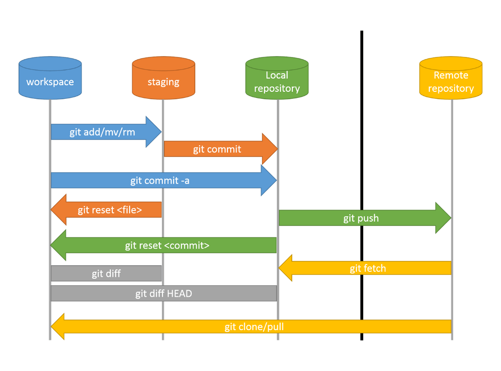

# Общие понятия в GIT:

| Git (Гит) | Распределённая система управления версиями для отслеживания изменений в файлах проекта. Позволяет разработчикам эффективно сотрудничать, отслеживать изменения и управлять версиями кода. |
| :---: | :---: |
| **Repository (Репозиторий)** | Хранилище всех файлов, истории изменений и метаданных проекта. Содержит все версии файлов и информацию о коммитах. |
| **Commit (Коммит)** | Фиксация изменений в репозитории. Содержит информацию о внесённых изменениях, авторе, времени и других метаданных. Коммиты образуют историю изменений проекта. |
| **Branch (Ветка)** | Отдельная линия разработки в репозитории. Позволяет работать над разными функциями или исправлениями параллельно. |
| **Tag (Тег)** | Именованная точка в истории коммитов. Используется для пометки версий проекта (релизов). |
| **Remote Repository (Удаленный репозиторий)** | Копия репозитория на удалённом сервере. Позволяет разработчикам совместно работать и синхронизировать изменения. |
| **Index (Индекс)** | Промежуточный шаг между рабочим каталогом и коммитом. Содержит изменения, которые будут включены в следующий коммит. |
| **HEAD** | Указатель на текущий коммит в активной ветке. Показывает, где вы сейчас находитесь. |
| **Pull Request (PR) / Merge Request (MR)** | Механизм совместной работы для предложения изменений в коде проекта, их рассмотрения и включения в основную ветку. |
| **Merge (Слияние)** | Объединение изменений из одной ветки с другой. Процесс включения изменений из одной ветки в другую. |
| **Merge Conflict (Конфликт слияния)** | Ситуация, когда Git не может автоматически объединить ветки из-за конфликтующих изменений. Требует ручного разрешения. |
| **Rebase (Ребейз)** | Перенос коммитов из одной ветки на вершину другой ветки. Создаёт линейную историю. |
| **Cherry-pick** | Применение конкретного коммита из одной ветки в другую. |
| **Fork** | Личная копия чужого репозитория на GitHub/GitLab для внесения изменений без прямого доступа к исходному репозиторию. |
| **Origin** | Имя по умолчанию для основного удалённого репозитория. |
| **Upstream** | Исходный репозиторий, от которого был сделан форк. |



# Инструкция по GIT:

### Ссылки на скачивание самого ПО:

| ОС | Ссылка |
|---|---|
| Windows | https://git-scm.com/download/win |
| Linux | https://git-scm.com/download/linux |
| macOS | https://git-scm.com/download/mac |

### 1.1 Если с нуля, то:
```bash
$ mkdir Desktop/name_repository/ # Создаем папку-репозиторий
$ cd Desktop/name_repository/    # Переходим в неё
$ git init                       # Приклеиваемся к репозиторию (делаем папку репозиторием для Git)
```

### 1.2 Если репозиторий уже есть, то клонируем его:
`$ git clone https://github.com/DragonDamage/Git-instruction.git`

Результатом клонирования появится папка `/Git-instruction` в данном случае

### 1.3 Если уже есть локальная копия, то можно обновить в ней изменения сделанные удаленно в ветке develop/master другими разработками, командой:
```bash
$ git pull origin {branch_name}  # Получить изменения с удалённой ветки
$ git checkout {branch_name}     # Переключиться на нужную ветку
```
_______________________________________________________________________________________________________________________________________________________________________

### 2. Далее первичные настройки:
```bash
$ git config --global user.name {user_name}      # Вводим имя
$ git config --global user.email {name@mail.ru}  # Вводим меил
$ git config --list                      # Посмотреть все конфиги
$ git config --global color.ui true      # Настройка подцветки
$ git config --global color.status auto  # Настройка подцветки статусов
$ git config --global color.branch auto  # Настройка подцветки веток
```
✔️Git готов к работе, можешь производить свои изменения или же проект с нуля

### 3. Дальнейшие действия, после внесения твоих изменений:
```bash
$ git status     # Показать какие файлы были изменены
$ git add —-all  # Добавить все изменения, либо добавить только выбранный файл $ git add {file_name}
$ git status     # Убедиться что изменения видны и стали зелёными
$ git commit –m "add change"        # Коммитим и ставим комментарий
$ git push –u origin {branch_name}  # Заливаем (пушим) изменения на удаленный репозиторий
$ git push --set-upstream origin {new_branch_name}  # Если создали ветку локально и нужно залить изменения на удалённый репозиторий
```
### Готово :+1:

## О файле `.gitignore`
Данный файл можно создать в репозитории, и он будет игнорировать коммиты файлов, которые ты туда запишешь. (каждая папка/файл на новой строке) Пример заполнения:
```bash
# Зависимости
node_modules/
vendor/
.env
# Файлы сборки
dist/
build/
*.exe
*.dll
*.so
*.dmg
# Логи
*.log
npm-debug.log*
yarn-debug.log*
# Файлы IDE
.vscode/
.idea/
*.swp
*.swo
# OS файлы
.DS_Store
Thumbs.db
# Файлы с секретами
.env
*.pem
*.key
secrets.yml
# Исключить все .txt файлы, кроме example.txt
*.txt
!example.txt
# Игнорировать файлы в папке logs, но не саму папку
logs/
!logs/.gitkeep
```

## Работа с ветками (branches)
```bash
$ git branch -a                # Посмотреть все ветки проекта
$ git branch {branch_name}     # Создать новую ветку
$ git checkout {branch_name}   # Переключиться в нужную ветку
$ git merge {branch_name}`     # Обьединить ветку и все изменения с веткой `master` (выполняется из ветки `master`)
$ git branch -d {branch_name}  # Удалить ветку
```

## Работа с коммитами (commit)
```bash
$ git log                       # Посмотреть историю коммитов (HEAD - это последний коммит)
$ git log --pretty=oneline      # Показать список всех коммитов, включая те, которые еще не были отправлены в удаленный репозиторий
$ git show {commit_id}          # Показать что это был за коммит (хэш коммита)
$ git reset --hard {commit_id}  # Перейти на нужный коммит, игнорируя предыдущие
```

## Дополнительные команды:
```bash
$ git add {File_1} {File_2}  # Добавить только 2 файла в коммит
$ git checkout .             # Отменить изменения, которые были сделаны локально
$ git reset                  # Вытащить из коммита
$ git reset --hard HEAD~1    # Отменить изменения до предыдущего коммита
$ git restore {file_name}    # Отменить изменения до предыдущего коммита
$ git restore --staged {file_name}           # Отменить изменения до предыдущего коммита, которые уже подготовлены для следующего коммита
$ git diff                                   # Показать все изменения в файлах
$ git diff --staged                          # Показать все изменения, которые уже подготовлены для коммита
$ git commit -am "add_change"                # Добавляем и коммитим все изменения + ставим комментарий
$ git mv {file_name} {new_file_name}         # Переименовать файл
$ git mv {file_name} {/folder/new_file_name} # Переименовать и перенести файл в другую директорию + выполнение git add автоматически
$ git rm {file_name}                         # Удалить файл
$ git remote add origin https://github.com/DragonDamage/Git-instruction.git  # Подключение к локальному репозиторию (origin - главный/удаленный)
$ git remote -v                            # Посмотреть список удаленных репозиториев, связанных с нашим локальным репозиторием
$ git fetch origin                         # Загрузить недостающие коммиты в локальном репозитории, но не объединять эти изменения с нашей локальной веткой
$ git merge origin/master                  # Объединить изменения из удаленной ветки origin/master с нашей текущей локальной веткой
$ git rebase master                        # Перенести изменения из текущей ветки в ветку `master`
$ git push -f origin master                # Переписать историю ветки в которой находишься в ветку `master`
$ git tag {tag_name}                       # Добавить простой тэг к коммиту
$ git tag -a {tag_name} -m "{you_comment}" # Добавить подробный тэг к коммиту
$ git push --tags                          # Отправить все тэги на сервер 
```
---

### Полезно для твоей ветки `master` в github.com (чтобы никто не сделал force push master)

Settings -> Branches -> Add rule -> вводим: master -> create


## Возможные ошибки и их решения:

Ошибка - `error: failed to push some refs to 'git@github.com:DragonDamage/Ansible.git'`

Решение ошибки при пуше в репу:
```bash
$ git pull --rebase origin main
$ git push -u origin main
```


# Очень подробно
## Работа с ветками (Branches)
#### Основные команды для работы с ветками
```bash
# Просмотр веток
$ git branch      # Локальные ветки
$ git branch -a   # Все ветки (локальные + удалённые)
$ git branch -r   # Только удалённые ветки
$ git branch -v   # Ветки с последним коммитом
$ git branch -vv  # Ветки с информацией об upstream

# Создание веток
$ git branch feature/new-feature           # Создать ветку (без переключения)
$ git checkout -b feature/new-feature      # Создать и переключиться
$ git switch -c feature/new-feature        # Альтернативный синтаксис (Git 2.23+)
$ git branch feature/new-feature {commit}  # Создать ветку от конкретного коммита

# Переключение между ветками
$ git checkout main
$ git switch main    # Альтернативный синтаксис
$ git checkout -     # Переключиться на предыдущую ветку

# Удаление веток
$ git branch -d feature/old-branch         # Удалить локальную ветку (безопасно)
$ git branch -D feature/old-branch         # Принудительное удаление
$ git push origin --delete feature/branch  # Удалить удалённую ветку
$ git push origin :feature/branch          # Альтернативный синтаксис

# Переименование ветки
$ git branch -m old-name new-name         # Переименовать текущую ветку
$ git branch -m feature/old feature/new   # Переименовать указанную ветку
```
#### Слияние веток (Merge)
```bash
# Слияние ветки в текущую
$ git checkout main
$ git merge feature/new-feature

# Слияние с созданием merge-коммита (даже если fast-forward возможен)
$ git merge --no-ff feature/new-feature

# Слияние без автоматического коммита (для проверки)
$ git merge --no-commit feature/new-feature

# Отмена слияния
$ git merge --abort
```
#### Перебазирование (Rebase)
```bash
# Перебазирование текущей ветки на master
$ git checkout feature/branch
$ git rebase master

# Интерактивный rebase (изменение истории)
$ git rebase -i HEAD~3          # Изменить последние 3 коммита
$ git rebase -i {commit_hash}   # Изменить коммиты начиная с указанного

# Продолжить после разрешения конфликтов
$ git rebase --continue
$ git rebase --skip             # Пропустить коммит
$ git rebase --abort            # Отменить rebase
```
### Разница между merge и rebase
| Операция | Merge | Rebase |
| :---: | :---: | :---: |
| История | Сохраняет порядок и временные метки коммитов | Создаёт линейную историю |
| Ветки | Создаёт merge-коммит | Переписывает коммиты |
| Когда использовать | Публичные ветки, командная работа | Локальные ветки, очистка истории |

## Работа с коммитами
#### Просмотр истории
```bash
# Базовая история
$ git log                        # Полная история
$ git log --oneline              # Компактный вид
$ git log --oneline --graph      # Графическое отображение веток
$ git log --oneline --graph --all --decorate  # Все ветки с указателями

# Фильтрация истории
$ git log --author="username"    # По автору
$ git log --since="2 weeks ago"  # По времени
$ git log --grep="fix"           # По сообщению коммита
$ git log -S"function_name"      # По содержимому (поиск изменений)

# Просмотр конкретного коммита
$ git show {commit_hash}          # Информация о коммите
$ git show --stat {commit_hash}   # Только изменённые файлы
$ git show {commit_hash}:file.txt # Содержимое файла на момент коммита
```
#### Изменение коммитов
```bash
# Исправление последнего коммита
$ git commit --amend -m "Новое сообщение"
$ git commit --amend --no-edit   # Добавить файлы без изменения сообщения

# Изменение старых коммитов (интерактивный rebase)
$ git rebase -i HEAD~3
# В редакторе:
# pick    - оставить коммит
# reword  - изменить сообщение
# edit    - остановиться для правки
# squash  - объединить с предыдущим
# fixup   - объединить, отбросив сообщение
# drop    - удалить коммит

# Применение конкретного коммита из другой ветки
$ git cherry-pick {commit_hash}  # Применить один коммит
$ git cherry-pick {hash1} {hash2}  # Применить несколько
$ git cherry-pick {hash1}..{hash2} # Применить диапазон
```

## Работа с удалёнными репозиториями
#### Управление удалёнными репозиториями
```bash
# Просмотр удалённых репозиториев
$ git remote -v                   # Список с URL
$ git remote show origin          # Подробная информация

# Добавление удалённого репозитория
$ git remote add origin https://github.com/user/repo.git
$ git remote add upstream https://github.com/original/repo.git

# Изменение URL
$ git remote set-url origin git@github.com:user/repo.git

# Удаление удалённого репозитория
$ git remote remove upstream

# Переименование
$ git remote rename origin upstream
```
#### Синхронизация
```bash
# Получение изменений без слияния
$ git fetch origin                # Получить все ветки
$ git fetch origin main           # Получить конкретную ветку
$ git fetch --prune               # Удалить информацию о удалённых ветках

# Pull с разными стратегиями
$ git pull                        # fetch + merge
$ git pull --rebase               # fetch + rebase
$ git pull --ff-only              # Только fast-forward (отказ, если конфликт)

# Push с разными опциями
$ git push origin main            # Отправить в удалённую ветку
$ git push -u origin main         # Установить upstream (связь)
$ git push --all origin           # Отправить все ветки
$ git push --tags origin          # Отправить теги
$ git push -f origin main         # Принудительная отправка (осторожно!)
$ git push --force-with-lease     # Безопасный force push (проверяет изменения)
```
#### Работа с форками `forks`
```bash
# Клонировать свой форк
$ git clone git@github.com:yourname/repo.git
$ cd repo

# Добавить upstream (исходный репозиторий)
$ git remote add upstream git@github.com:original/repo.git

# Получить изменения из исходного репозитория
$ git fetch upstream
$ git checkout main
$ git merge upstream/main
$ git push origin main

# Обновить ветку из upstream
$ git checkout feature/branch
$ git rebase upstream/main
$ git push -f origin feature/branch
```

## Работа с тегами `Tags`
#### Создание тегов
```bash
# Простые теги (lightweight)
$ git tag v1.0.0                  # Тег на текущем коммите
$ git tag v1.0.0 {commit_hash}    # Тег на конкретном коммите

# Аннотированные теги (рекомендуются для релизов)
$ git tag -a v1.0.0 -m "Версия 1.0.0 - первая стабильная версия"
$ git tag -a v1.0.0 {commit_hash} -m "Релизная версия"

# Подпись тега GPG (для верификации)
$ git tag -s v1.0.0 -m "Подписанный тег"
```
#### Просмотр и управление тегами
```bash
# Просмотр тегов
$ git tag                          # Список всех тегов
$ git tag -l "v1.*"                # Поиск по шаблону
$ git show v1.0.0                  # Информация о теге

# Отправка тегов на удалённый репозиторий
$ git push origin v1.0.0           # Отправить конкретный тег
$ git push origin --tags           # Отправить все теги
$ git push --follow-tags           # Отправить коммиты и связанные теги

# Удаление тегов
$ git tag -d v1.0.0                # Удалить локальный тег
$ git push origin --delete v1.0.0  # Удалить удалённый тег
$ git push origin :v1.0.0          # Альтернативный синтаксис

# Перемещение тега (осторожно!)
$ git tag -f v1.0.0                # Переместить локальный тег
$ git push -f origin v1.0.0        # Принудительно обновить удалённый тег
```

